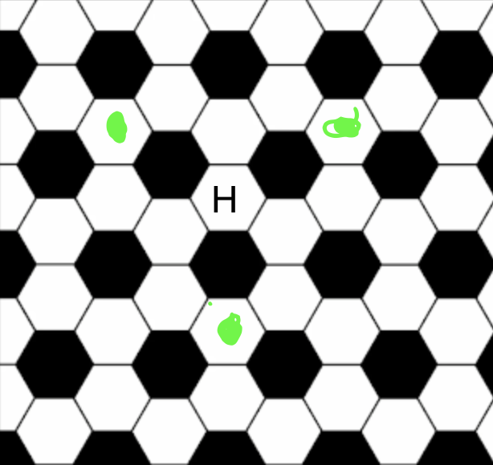
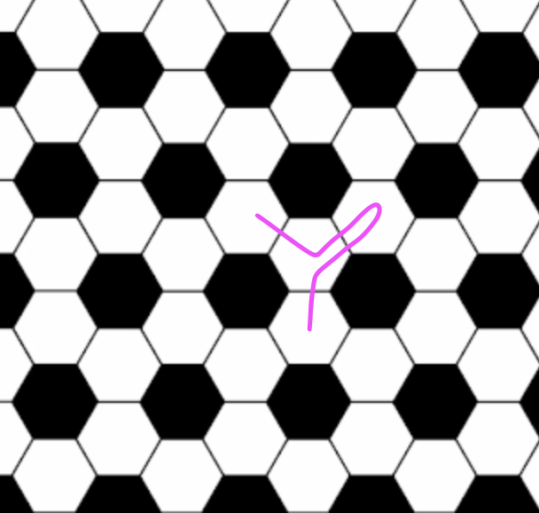
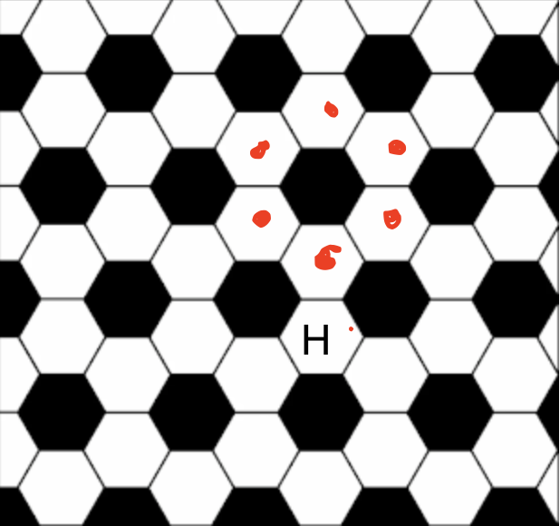

# Jane Street August 2026 puzzle solution

## The August 2026 Jane Street puzzle can be found at https://www.janestreet.com/puzzles/

---

In the problem, a few things can be easily be deduced: 

1. Both the blue and red path would step on every white hexagon on the ball, hence one of them would be the home space. As a result, a red or blue path would need to include the home space on the kitchen floor as well, otherwise he would know that he left the ball. 

2. If Andy is on his home space, he would end up back on the same hexagon if he did three moves, where the 2nd and 3rd move have the same parity (left or right). Because of this, he can not end up on any of the hexagons marked green and still think he is on the ball. 

3. Andy can not do two moves on the ball with the same parity (left or right) in a row, and then go back one hexagon, only to do a move with the same parity without one of the hexagons being the home space. Therefore, in order to not find out he left the ball, he cant walk any version (mirrored or turned) of the pink path on the kithen without him landing on the home space. 

---

These three deductions forces Andy to either, walk only on the hexagons marked red (because of symetry it can be assumed that those are the only ones) or find out that he fell of the ball. 

This creates a markov chain with E1 - E4 with E1 being the closest to H and E4 being the furtest. 

E1 =  1/3 + E2 * 2/3
E2 = E1 * 1/3 + E3 * 1/3
E3 = E2 * 1/3 + E4 * 1/3
E4 = E3 * 2/3

this can then be solved as follows: 

E3 = E2 * 1/3 + E3 * 2/9
E3 = E2 * 3/7
E2 = E1 * 1/3 + E2 * 1/7
E2 = E1 * 7/18

E1 = 1/3 + E1 * 7/27
E1 = 9/20

Since Andy is forced to move to E1 from his home square (because of symetry), the probabilty that he discovered that he is no longer on the truncated tetrahedral sphere after his afternoon amble, is 1 - E1 which is 1 - 9/20 = 11/20

Answer: P = 11/20
