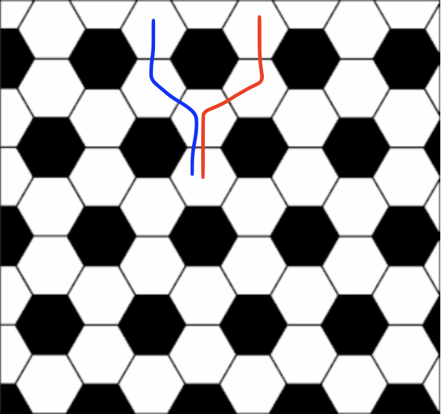

# Jane Street August 2026 puzzle solution

## The August 2026 Jane Street puzzle can be found at https://www.janestreet.com/puzzles/

In the problem, a few things can be easily be deduced: 

1. Both the blue and red path would step on every white hexagon on the ball, hence one of them would be the home space. As a result, a red or blue path would need to include the home space on the kitchen floor as well. 